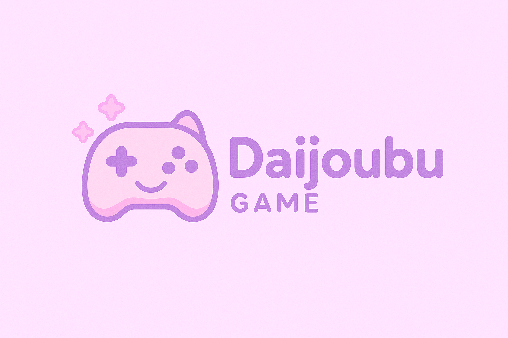

<p align="center">
	
</p>

# Daijoubu — Anime Mini‑Games

## Overview

Daijoubu is a small Nuxt 3 app with three mini‑games:

- Puzzle: Upload an image, pick rows/columns, and reveal tiles to uncover the picture. Great for streams or party play.
- Guess the Anime: Multiple‑choice rounds with progressive hints (type, year, episodes, studio, genres) and a blurred cover that unblurs after answering.
- Animedle: Wordle‑style guessing game for Anime titles or Characters. Progressive hints and on‑screen keyboard with mobile typing support.

## Framework

- Nuxt 3 (Vue 3 + TypeScript)
- UI and utilities: @nuxt/ui, @nuxt/icon, @nuxt/image, @nuxt/fonts, @nuxt/scripts

## APIs

This app uses the public Jikan API (MyAnimeList data) from the client
Notes:
- Be mindful of Jikan’s public rate limits. Requests are staggered and batched modestly in components to play nicely.
- No server secrets are required; all calls are public endpoints.

## Deploy with Vercel

## Local development

Use any package manager. Examples below use PowerShell:

```powershell
# with npm
npm install
npm run dev

# or with pnpm
pnpm install
pnpm dev

# or with Bun
bun install
bun run dev
```

Build preview:

```powershell
npm run build
npm run preview
```

## License

This project’s **source code** is licensed under the [MIT License](LICENSE).

---

**Disclaimer**  
While the source code is provided under the MIT License, **all content (such as anime images, titles, descriptions, and other media)** and **third-party APIs** used by this project are subject to their own licenses or terms of service.  
You must ensure compliance with those licenses before using, distributing, or deploying the project in any form.

**Third-party services used:**
- **[Jikan API](https://jikan.moe/)** — Provides MyAnimeList data. See their [Terms of Service](https://jikan.moe/) and [GitHub repository license](https://github.com/jikan-me/jikan).
- Any anime titles, images, or metadata remain the property of their respective copyright holders.

**Important:**  
This project is for educational and non-commercial purposes. Using copyrighted media for commercial purposes without permission may infringe on the rights of the copyright holders.

